# OpenShift on SimpliVity

OpenShift Version Installed: OCP 4.1

- [Introduction](#introduction)
- [HA Considerations](#ha-considerations)
  - [The Control Plane (master nodes)](#the-control-plane-master-nodes)
  - [DNS and DHCP services](#dns-and-dhcp-services)
  - [Load Balancers](#load-balancers)
- [Deployment of the control plane](#deployment-of-the-control-plane)
  - [Requirements](#requirements)
  - [Prepare an Ansible box](#prepare-an-ansible-box)
  - [Prepare a RHEL template](#prepare-a-rhel-template)
  - [Prepare an OVA file (optional)](#prepare-an-ova-file-optional)
  - [Download Required Files](#download-required-files)
  - [Clone the repo](#clone-the-repo)
  - [Prepare to run the playbooks](#prepare-to-run-the-playbooks)
    - [Configure the playbooks](#configure-the-playbooks)
    - [Create your inventory](#create-your-inventory)
    - [About Load Balancers](#about-load-balancers)
      - [Managed Load Balancers with HA](#managed-load-balancers-with-ha)
      - [Managed Load Balancers, no HA](#managed-load-balancers-no-ha)
      - [Un-managed Load Balancers](#un-managed-load-balancers)
  - [Deploy the Control Plane](#deploy-the-control-plane)
  - [Persistent Storage](#persistent-storage)
- [Customization](#customization)
  - [LDAP Integration](#ldap-integration)
    - [LDAP Authentication Requirements](#ldap-authentication-requirements)
    - [Preparation Steps](#preparation-steps)
    - [Running the playbook](#running-the-playbook)
    - [Verification](#verification)
  - [LDAP Integration, synchronizing groups](#ldap-integration-synchronizing-groups)
    - [Create the sync configuration file](#create-the-sync-configuration-file)
    - [Synchronize](#synchronize)
    - [Verifications](#verifications)
    - [More information](#more-information)
  - [Adding a cluster Administrator](#adding-a-cluster-administrator)
- [Scaling the resource plane with additional Worker nodes](#scaling-the-resource-plane-with-additional-worker-nodes)
  - [Scaling with Red Hat CoreOS Worker nodes](#scaling-with-red-hat-coreos-worker-nodes)
  - [Scaling with Red Hat Enterprise Linux 7.6 Worker nodes](#scaling-with-red-hat-enterprise-linux-76-worker-nodes)
- [External routes](#external-routes)
  - [Why external routes matter](#why-external-routes-matter)
  - [Create a simple application](#create-a-simple-application)
  - [Create an Ingress object for the application](#create-an-ingress-object-for-the-application)
- [Backup and Restore](#backup-and-restore)
  - [Configuring Backup](#configuring-backup)
  - [Backup files](#backup-files)
  - [Running backup_etcd.yml](#running-backup_etcdyml)
  - [Restore](#restore)
- [Cluster Logging](#cluster-logging)
  - [About Cluster Logging](#about-cluster-logging)
  - [Deploying the Cluster Logging (EFK) stack](#deploying-the-cluster-logging-efk-stack)
  - [Verify the Cluster Logging installation](#verify-the-cluster-logging-installation)
  - [Access the Kibana Dashboard](#access-the-kibana-dashboard)
- [Persistent Storage for Cluster Monitoring](#persistent-storage-for-cluster-monitoring)
  - [About Cluster Monitoring](#about-cluster-monitoring)
  - [Configuring Persistent Storage for Cluster Monitoring](#configuring-persistent-storage-for-cluster-monitoring)
- [Workload placement](#workload-placement)
  * [Specifying node labels in the Ansible inventory](#specifying-node-labels-in-the-ansible-inventory)
  * [Controlling the placement of infrastructure workloads](#controlling-the-placement-of-infrastructure-workloads)
    + [Moving router replicas to infrastructure nodes](#moving-router-replicas-to-infrastructure-nodes)
    + [Moving the registry to infrastructure nodes](#moving-the-registry-to-infrastructure-nodes)
    + [Moving the monitoring resources to infrastructure nodes](#moving-the-monitoring-resources-to-infrastructure-nodes)
    + [Moving the cluster logging resources to infrastructure nodes](#moving-the-cluster-logging-resources-to-infrastructure-nodes)
- [Appendices](#appendices)
  - [group_vars/all/vars.yml](#group_varsallvarsyml)
  - [group_vars/all/vault.yml](#group_varsallvaultyml)
  - [Inventory](#inventory)
  - [Environment](#environment)
  - [Monitoring the deployment](#monitoring-the-deployment)
  - [LDAP sample ldap_cr.yml](#ldap-sample-ldap_cryml)

# Introduction

The OpenShift Container Platform (OCP) 4.1 installer supports two deployments scenarios: IPI and UPI. **I**nstaller‑**P**rovisioned **I**nfrastructure (IPI) is only supported on AWS for now. Because we deploy on vSphere, we use the **U**ser-**P**rovisioned **I**nfrastructure (UPI) scenario which means we need to provision... the infrastructure.

This repository provides you with playbooks that you can use to:

1. Deploy Red Hat OpenShift Container Platform 4.1 on vSphere
2. Perform other post installation customizations

# HA Considerations

## The Control Plane (master nodes)

The playbook responsible for deploying the OCP master nodes configures anti-affinity rules to make sure DRS will distribute the 3 master nodes across the cluster and not have two master nodes running on the same host. This assumes that you deploy 3 master nodes and have at least 3 ESXi hosts in your cluster.

The name of the anti-affinity rule is built according to the following pattern:

`<clustername>-master-anti-affinity-rule-001`

where `<clustername>` is the name of your cluster as specified by `group_vars/all/vars.yml:cluster_name`

## DNS and DHCP services

Internal DNS and DHCP services are hosted by one or two virtual machines inside the inventory group called `[infrastructure]`. If you configure a single VM in this group, you don't have any redundancy other than the one provided by VMware HA . If you configure 2 VMs in this group an anti-affinity rule will be created to have these two VMs run on two different ESXi hosts.

The name of the anti-affinity rule is build according to the following pattern:

`<clustername>-infrastructure-anti-affinity-rule-001`

where `<clustername>` is the name of your cluster as specified by `group_vars/all/vars.yml:cluster_name`

## Load Balancers

In the case of managed load balancers, HA for the two load balancers (internal API and external API) is provided by mean of floating IP addresses managed by keepalived. The load balancers are hosted on two VMs which are members of the inventory group called `[loadbalancer]`. An anti-affinity rule is created for these virtual machines with the name:

`<clustername>-loadbalancer-anti-affinity-rule-001`

where `<clustername>` is the name of your cluster as specified by `group_vars/all/vars.yml:cluster_name`

The possible deployment options for the load balancers are described later in this document.

# Deployment of the control plane

The playbook `site.yml` is used to deploy the control plane, and zero or more CoreOS/RHCOS worker nodes. It does the following:

1. Run the OpenShift Installer to generate the ignition data required by the OpenShift virtual machines
2. Provision the virtual machines listed in the Ansible inventory and powers up the non-OCP virtual machines
3. Configure the services running on the non-OCP virtual machines including DNS and DHCP services.
4. Configure anti affinity DRS rules for the virtual machines (master VMs should run on separate hosts as well as the infrastructure (DNS and DHCP services) and load balancer VMs
5. Power up the OCP virtual machines
6. Wait for the OpenShift API to come up on the master nodes
7. Create a PV from an NFS share and a PVC for use by the OpenShift Registry
8. Configure the OpenShift Image Registry
9. Wait for all Cluster Operators to be available
10. Run the final step of the OpenShift Installation (wait-for installation-complete)

## Requirements

| Requirement (1)                                              | Choice Made                                               | Comment                                                      |
| :----------------------------------------------------------- | :-------------------------------------------------------- | :----------------------------------------------------------- |
| vCenter Infra 6.7U2                                          |                                                           | You need admin credentials                                   |
| ESXi cluster of three machines                               |                                                           | If you want HA you need three machines in the cluster and you need to deploy 3 masters |
| One proxy-free VLAN with access to Internet (to pull Red Hat artifacts) | a portgroup connected to all machines in your ESX cluster | The playbooks install DHCP services on this VLAN so no other DHCP service should be running on this VLAN |
| One routed subnet for use on the above VLAN                  |                                                           | from your net admin.                                         |
| One Access Network / VLAN plus the following number of IP addresses: 1+ n, where n is the number of load balancers | another portgroup                                         | from your net admin                                          |
| DNS and NTP services                                         |                                                           |                                                              |

The playbooks creates OCP VMs according to the following sizing:

| VM                                           | OS and Sizing                            | Comments                                     |
| :------------------------------------------- | :--------------------------------------- | :------------------------------------------- |
| 1 x bootstrap machine                        | CoreOS 4xCPU, 16GB RAM, 120GB disk space | This is the RH minimum requirement           |
| 3 x master machines                          | CoreOS 4xCPU, 16GB RAM, 120GB disk space | This is the RH minimum requirement           |
| n x worker machines (depending on inventory) | CoreOS 2xCPU, 16GB RAM, 120GB disk space | This is two times the RH minimum requirement |

The playbooks also creates the following VMs which provide additional infrastructure services required by OCP

| VM                            | OS and Sizing | Comments                                                     |
| :---------------------------- | :------------ | :----------------------------------------------------------- |
| 0, 1 or 2  x load balancer(s) | Red Hat 7.6   | The playbooks can deploy one or two virtual machines (two for redundancy purposes) if you don't have an external load balancer. |
| 1 or 2 x support VMs          | Red Hat 7.6   | One or two VMs providing DHCP and DNS services on the internal VLAN. Configure two for HA purposes |
| 1 x NFS                       | Red Hat 7.6   | one NFS VM to hold the OpenShift Registry images             |

## Prepare an Ansible box

- We use Fedora 29 and Ansible 2.8.1 (**REQUIRED**) (dnf update probably necessary)
- The Ansible box is directly connected to the proxy-free VLAN.
- The playbooks work from a non-privileged account. It will make your life easier if you work from an account named **core** because:
  - RH CoreOS built-in account is '**core'**
  - a user with the same name as the user who runs the playbooks on the Ansible box is created on non-CoreOS VMs
  - Populate the variable **group_vars/all/vault.yml:vault.ssh_key** with the default public key of the user who will run the playbooks (~/.ssh/id_rsa.pub)
- Make sure the user who runs the playbooks can `sudo` without a password on the Ansible box itself.
  - to be completed (see Linux doc, sudo)

## Prepare a RHEL template

The load balancer(s) and the infrastructure nodes are cloned from a RHEL7 template. You need to create this template. Use the following specs:

- 2 vCPUs
- 4GB of ram
- One disk, prefer thin provisioning. 50G is enough
- Guest OS family Linux/RHEL 7 64-bits
- Configure CD/DVD to connect to the RHEL7 ISO image at power on
- Take note of the name you give to the VM. (eg hpe-rhel760). You will document this name with the Ansible variable `group_vars/all/vars.yml:rhel_template:`

Power on the template and connect to the VM's console

- Select the language
- Installation destination: automatically configure partitioning
- Config network and hostname: assign an IP address or use DHCP depending on your environment
- Config time (prefer Etc/Coordinated Universal Time), configure NTP
- Software selection : base environment: Infrastructure Server, Add-ons for Selected Environment: Guest Agents
- Start the installation

While the installation runs configure a password for the root account. You don't need to create a user account.

Once the installation is finished, log in the VM (root account) and perform the following tasks:

- Change the hostname of the template giving it a name that you will recognize in your Red Hat Account (for example):

  `nmcli general hostname hpe-rhel760`

- Register the system with the Red Hat portal and attach it to a subscription. You can do this using the following command if you have created activations keys:

  `subscription-manager register --org=<your_org> --activationkey=<activation key> --auto-attach`

   If your Red Hat Network account does not use organization IDs and activation keys, you can instead register the server using your RHN username and password:

  `subscription-manager register --username <your_username> --password <your_password> --auto-attach`

- Update the machine

  `yum update -y`

- Install the cloud-init package that takes the VMware guestinfo interface as a data source

  `yum install -y https://github.com/vmware/cloud-init-vmware-guestinfo/releases/download/v1.1.0/cloud-init-vmware-guestinfo-1.1.0-1.el7.noarch.rpm`

- Clear the bash history

  `history -c`

- Un-register the system from the Red Hat network and remove subscription data

  `subscription-manager clean`

- Shutdown the machine

  `shutdown -h now`

**Note:** The playbooks have been tested with CentOS 7.6 as well. If you use CentOS you don't have to run the subscription-manager commands above.

Finally, make sure the name of this template matches the variable `group_vars/all/vars.yml:infra_template`.

## Prepare an OVA file (optional)

It is possible to deploy the `infra_template` from an OVA. To create the OVA proceed as indicated below:

- **Make sure** the one network interface of the template is connected to the network named 'VM Network'
- Set the CD/DVD for the template to client device (vs an ISO image in a Datastore)
- Select the template and export it as an OVF template
- Create a tar archive of **all** the files that where downloaded. The extension MUST be .ova (and not .tar)
- Copy the OVA file to a location that the Ansible user can access and use the ansible_variable `group_vars/all/vars.yml:infra_ova_path:` to tell the playbooks where you stored the OVA file.

**Note:** If a template with the name specified by `group_vars/all/vars.yml:infra_template` is found in the vCenter Datacenter, the OVA file will not be deployed and the existing template will be used to deploy non-CoreOS VMS. If the template is not found, the OVA file is deployed and the template is given the name documented by `infra_template`.

## Download Required Files

You need to copy a number of files to the Ansible box. We need the Linux installer, the Linux client and the Red Hat CoreOS OVA. The exact file names reflect the version of the release. At the time of writing, the latest version available for the OpenShift installer and the client tools was 4.1.4, and 4.1.0 for the Red Hat CoreOS VMware template. The ultimate reference for downloading required files is [here](https://cloud.redhat.com/openshift/install/vsphere/user-provisioned).

```bash
$ mkdir /kits
$ cd /kits
$ wget https://mirror.openshift.com/pub/openshift-v4/clients/ocp/latest/openshift-client-linux-4.1.4.tar.gz
$ wget https://mirror.openshift.com/pub/openshift-v4/clients/ocp/latest/openshift-install-linux-4.1.4.tar.gz
$ wget https://mirror.openshift.com/pub/openshift-v4/dependencies/rhcos/4.1/latest/rhcos-4.1.0-x86_64-vmware.ova
$ tar -xvf openshift-client-linux-4.1.4.tar.gz
$ tar -xvf openshift-install-linux-4.1.4.tar.gz
```

Download your pull secret from this page: <https://cloud.redhat.com/openshift/install/vsphere/user-provisioned>. You will use your pull secret to set a value to the variable `group_vars/all/vault.yml:vault.pull_secret`.

If the account you use on the Ansible box does not have a default SSH keypair, create one (using ssh-keygen). If you configure a passphrase on the private key, make sure the key is added to your SSH agent. The content of the file ~/.ssh/id_rsa.pub should be used to configure the key `group_vars/all/vault.yml:vault.ssh_key`.

More info on variables later.

## Clone the repo

From the Ansible box (user core)

```bash
$ git clone https://github.com/HewlettPackard/OpenShift-on-SimpliVity.git
```

## Prepare to run the playbooks

### Configure the playbooks

- Copy `group_vars/all/vars.yml.sample` to `group_vars/all/vars.yml`
- Edit `group_vars/all/vars.yml` to match your environment. More details can be found [here](#vars_yml)
- Copy `group_vars/all/vault.yml.sample` to `group_vars/all/vault.yml`
- Edit `group_vars/all/vault.yml` to match your environment. More details can be found [here](#vault-yml)

**Note:** you don’t need to edit the group files (such as `group_vars/master.yml`) unless you want to change the sizing of the VMs.

### Create your inventory

Make a copy of the file `hosts.sample` to - say - `hosts`. This will be your inventory. Modify `hosts` to match your environment:

- Use unique names in the vCenter environment, recommended VM names in the form xxx-master0, xxx-lb1 etc, where xxx is the name of your cluster.

  **Note:** underscores (_) are not valid characters in hostnames

- Use your own IP addresses and not those coming from the sample file

- Configure one or two machines in the `[infrastructure]` group. Configure two VMs if you want HA. Configure only one if you don't need HA.

- Ensure that no un-commented entries are present in the `[rhel_worker]` inventory group until **after** the OpenShift control plane has been successfully deployed. While OCP 4.1 does support worker nodes running Red Hat Enterprise Linux 7 (RHEL7), these worker nodes can only be added to the OCP cluster **after** the control plane is deployed and running. For more information about scaling the resource plane with additional RHCOS or RHEL7 worker nodes, see [Scaling the resource plane with additional Worker nodes](#scaling-the-resource-plane-with-additional-worker-nodes).

- Load balancers need to have two IP addresses. One on the internal network designated by `group_vars/all/vars.yml:vm_portgroup` and specified with the `ansible_host` variable. A second address for the frontend network designated by the variable `frontend_ipaddr` in the inventory. `frontend_ipaddr` should be specified in CIDR notation (for example 10.10.174.165/22).

More information regarding load balancers is provided in the next paragraph.

### About Load Balancers

#### Managed Load Balancers with HA

You can configure 2 virtual machines in the inventory group named `[loadbalancer]`. The two virtual machines are connected to two networks, an external network, also called the frontend network, and an internal network also called the backend network. Both VMs are eligible for hosting two floating IP addresses (FIPs), one for external access to the OCP API and a second for internal access to the OCP API. The first IP binds to the external network and the second to the internal network.

**Note:** the internal network is the one which connects all the OCP VMs together (this is the network that the variable `group_vars/vars/all.yml:vm_portgroup` designates). The external network is the one designated by the variable `group_vars/all/vars.yml:frontend_vm_portgroup`.

The floating IP addresses are managed with `keepalived` using the VRRP protocol. These IP addresses and additional settings are configured using the variable `group_vars/all/vars.yml:loadbalancers`.

In the Ansible inventory, each VM can specify the following variables:

- `api_int_preferred`: The VM specified with this variable will be the preferred VM for hosting the internal VIP for the OCP API,
- `api_preferred`: The VM specified with this variable will be the preferred VM for hosting the external VIP for the OCP API

For example, in the inventory below, the VM named `hpe-lb1` will host the internal FIP whereas `hpe-lb2` will host the external FIP. If one of these two VMs fails, the FIPs are migrated to the surviving VM.

```bash
[loadbalancer]
hpe-lb1 ansible_host=10.15.152.7 frontend_ipaddr=10.15.156.7/24 api_int_preferred=
hpe-lb2 ansible_host=10.15.152.8 frontend_ipaddr=10.15.156.8/24 api_preferred=
```

**Note:** You need to enter an equal sign after `api_int_preferred` and `api_preferred`.

The corresponding variables in `group_vars/all/vars.yml` look like the snippet below.

```bash
frontend_vm_portgroup: 'extVLAN2968' # Name of the portgroup / external network
frontend_gateway: '10.15.156.1'      # gateway for the external network
loadbalancers:
  apps:
    vip: 10.15.156.9/24
  backend:
    vip: 10.15.152.9/24
    interface: ens192
    vrrp_router_id: 51
  frontend:
    vip: 10.15.156.9/24
    interface: ens224
    vrrp_router_id: 51
```

**Note:** The names of the interfaces are OS dependent and depend on how the VMs are built. If you are using the playbooks of this repository and deploy Red Hat Enterprise 7.6 you should not have to change these names.

The figure below illustrates such a deployment

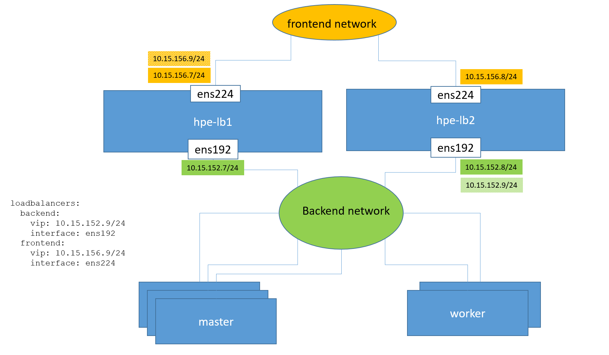

#### Managed Load Balancers, no HA

If you don't want HA (for demo purposes for example), you can configure a single VM in the `[loadbalancer]` group and you can delete the `vip` properties from the `loadbalancers` data structure.

Here is a snippet of an Ansible inventory which specifies a unique VM in the `[loadbalancer]` group.

```bash
[loadbalancer]
hpe-lb1 ansible_host=10.15.152.7 frontend_ipaddr=10.15.156.7/24
```

The `loadbalancers` data structure does not specify any FIP as shown below. No FIP is used and the IP addresses of this VM will be use for the OCP API. In this example, the external endpoint for the OCP API will point to 10.15.156.7 and the internal endpoint will point to 10.15.152.7)

```bash
frontend_vm_portgroup: 'extVLAN2968'  # Name of the portgroup / external network
frontend_gateway: '10.15.156.1'       # gateway for the external network
loadbalancers:
  apps:
  backend:
    interface: ens192
  frontend:
    interface: ens224
```

The figure below illustrates such a deployment:

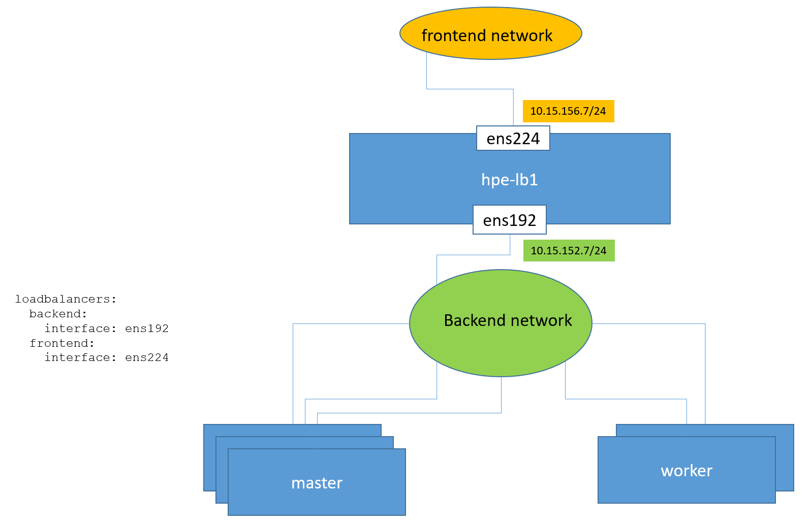

#### Un-managed Load Balancers

You may use your own load balancing solution by NOT configuring any VM in the `[loadbalancer]` group and by documenting the data structure `loadbalancers` in `group_vars/all/vars.yml`.

Note that these un-managed load balancers should be configured as explained in the OpenShift 4.1 installation documentation.

In the example Ansible inventory below, the `[loadbalancer]` group is left empty.

```bash
[loadbalancer]
# hpe-lb1 ansible_host=10.15.152.7 frontend_ipaddr=10.15.156.7/24 api_int_preferred=
# hpe-lb2 ansible_host=10.15.152.8 frontend_ipaddr=10.15.156.8/24 api_preferred=
```

sample `group_vars/all/vars.yml` (snippet)

```bash
frontend_vm_portgroup: 'extVLAN2968'
frontend_gateway: '10.15.156.1'
loadbalancers:
  apps:
    vip: 10.15.156.9/24
  backend:
    vip: 10.15.152.9/24
    interface: ens192   # unused if external load balancer
    vrrp_router_id: 51  # unused if external load balancer
  frontend:
    vip: 10.15.156.9/24
    interface: ens224   # unused if external load balancer
    vrrp_router_id: 51  # unused if external load balancer
```

**Note:** Do not delete the `[loadbalancer]` group from the inventory but leave it empty if you want to use existing external load balancers.

## Deploy the Control Plane

**WARNING:** Make sure you run the `site.yml` playbook from the top-level directory of the git repository. The repository comes with an `ansible.cfg` file and a number of options which are required.

Provided you clones the repository under `~/OpenShift-on-SimpliVity`, perform the following commands on your Ansible machine to deploy the OpenShift 4.1 control plane:

```bash
$ cd ~/OpenShift-on-SimpliVity
$ ansible-playbook –i hosts site.yml --vault-password-file .vault_pass
```

**Note:** Depending on your hardware and the load, it takes approximately 30/35mns for the playbook to finish its work. Refer to this [appendix](#appendix-monitoring-the-deployment) if you want to monitor the progresses of the deployment.

## Persistent Storage

By default the OpenShift installer configures a default storage class which uses the vSphere Cloud Provider. This provider does not support the [ReadWriteMany](https://docs.openshift.com/container-platform/4.1/installing/installing_vsphere/installing-vsphere.html#installation-registry-storage-config_installing-vsphere) access mode which is required by the Image Registry. For this reason, the `site.yml` playbook deploys an NFS virtual machine which exports a number of NFS shares. The Image Registry service will use one of these. The number of shares that the playbooks creates can be customized using the variable `group_vars/all/vars.yml/num_nfs_shares`. Only one share is required by the Image Registry service. Use vSphere volumes in your apps if you don't need `ReadWriteMany` access mode.

# Customization

The installation of the control plane is finished. You are ready to start the customization of your deployment as explained here: <https://docs.openshift.com/container-platform/4.1/installing/install_config/customizations.html#customizations>

Note The kubeconfig and kubeadmin-password files are located in the `auth` folder under your `install_dir` directory (specified in `group_vars/all/vars.yml`). The kubeconfig file is used to set environment variables needed to access the OCP cluster via the command-line. The kubeadmin-password file contains the password for the "kubeadmin" user, which may be useful for logging into the OCP cluster via the web console.

A number of playbooks are provided which will help you with the customization. Let's start with LDAP integration.

## LDAP Integration

This repository comes with a playbook that will help you configure your LDAP service as an identity provider for the cluster you deployed with `site.yml`. The playbook was tested with a Microsoft Active Directory service.

This section assumes that you have some basic knowledge of Directory Services. If you don't, you will probably need to read some literature on the subject. You may start with this [tutorial](https://www.digitalocean.com/community/tutorials/understanding-the-ldap-protocol-data-hierarchy-and-entry-components). You will also need to understand what [RFC 2255 URLs](https://tools.ietf.org/html/rfc2255) are and how to build them to query your Directory Services.

### LDAP Authentication Requirements

The following information must be available to configure LDAP based authentication:

- Username (referred to Bind DN) and password (referred to Bind Password) of a user that has access to traverse the LDAP tree.
- Protocol, hostname and port of the LDAP server
- CA bundle of the LDAP server. It is highly recommended that communications occur over a secure connection (use `ldaps` vs `ldap`)
- Base DN location for which users will be searched
- Additional filtering logic, such as the scope of the user query and an optional filter.

The playbook does not have an understanding of the layout of your Directory and cannot figure it out. Which means you need to have this understanding (or get it from your Directory Service administrator). Once you have this understanding, you can model it in a so-called Custom Resource that the playbook will use to configure an [Identity Provider](https://docs.openshift.com/container-platform/4.1/authentication/understanding-identity-provider.html). OpenShift 4.1 supports different types of identity providers such as HTPasswd, Keystone etc. including LDAP which is the subject of this integration.

### Preparation Steps

Here is what you should do before running the playbook:

1. Edit the file `group_vars/all/vars.yml` and specify the bind DN you want to use to traverse the LDAP tree. For this purpose configure the variable `ldap_bind_user_dn:` The Bind Password is specified with the variable `ldap_bind_user_password`, using an indirection to follow the best practice. The actual value of this password is stored in the file `group_vars/all/vault.yml` which you should encrypt with `ansible-vault`. In the **example** below, the user `adreader` (which must exists) will be used to bind with the LDAP service. Make sure you leave the variable `ldap_bind_user_password` unchanged.

   ```bash
   ldap_bind_user_dn: "cn=adreader,cn=Users,dc=am2,dc=cloudra,dc=local"
   ldap_bind_user_password: "{{ vault.ldap_bind_user_password }}"
   ```

   **Note:** The playbook will create a secret to store the password for the binding user.

2. Edit `group_vars/all/vault.yml` (preferably using `ansible-vault` because you want this file to be encrypted) and configure the variable `vault.ldap_bind_user_password`. This is the password for the LDAP user you use for binding with the LDAP service.

   ```bash
   vault:
     ldap_bind_user_password: 'YourPasswordHere'
   ```

4. The playbook supports secure LDAP which means you need to configure the identity provider with the CA Bundle of the LDAP server. This bundle should be exported in PEM format. How you retrieve this CA bundle depends on your environment and is beyond the scope of this documentation. Once you have this bundle, store it in a file somewhere on the Ansible box where your ansible user can access it and edit `group_vars/all/vars.yml` and the variable `ldap_ca_file` to have this variable point to your CA bundle.

   **Note:** the playbook creates a ConfigMap to store this bundle.

5. You also need to provide the playbook with a custom resource file.  The OpenShift 4.1 documentation explains how to populate this file [here](https://docs.openshift.com/container-platform/4.1/authentication/identity_providers/configuring-ldap-identity-provider.html) . Because the content of this file is highly customizable we did not try to parameterize it. The url in this file is an [RFC 2255](https://tools.ietf.org/html/rfc2255) URL. An [Appendix](#ldap_cr_yml) later in this document reproduces and comments the default `ldap_cr.yml` that this repository ships. Create your **own copy** of the `ldap_cr.yml` file, store it somewhere on your Ansible box where the Ansible user can access it then configure the variable `ldap_cr_file` in `group_vars/all/vars.yml` to point to your resource file. 

**Note:** Before you attempt to run `playbooks/ldap.yml` you may want to test your settings with a tool like `ldapsearch` (for example). If you cannot query your LDAP with the Bind DN, Bind password and CA Bundle your configured earlier then the identity provider that the playbook configures will fail to interact with your LDAP service.

An example of query is shown below where we bind with the user `adreader` to query a user called `john`, the directory service being hosted by a server named `mars-adds.am2.cloudra.local`.

```bash
$ ldapsearch -H ldaps://mars-adds.am2.cloudra.local \
         -x -w '(redacted)' -D "cn=adreader,cn=Users,dc=am2,dc=cloudra,dc=local" \
         -b "cn=Users,dc=am2,dc=cloudra,dc=local" \
         "(&(objectClass=person)(sAMAccountName=john))"`
```

The query above is similar to the query that the Identity provider will run against the LDAP service whenever someone wanted to log in as `john` would the `ldap_cr.yml` specify the following URL:

```bash
ldaps://mars-adds.am2.cloudra.local/CN=Users,DC=am2,DC=cloudra,DC=local?sAMAccountName??(objectClass=person)
```

You may want to use `ldapsearch` using insecure connections first (if your LDAP server allows these type of connections) then configure `ldapsearch` with the CA certificate that signed the certificate of your LDAP server and use `ldaps` connections. It is highly recommended to use secure LDAP connections (`ldaps`) in a production environment.

### Running the playbook

Once you are ready with the preparation steps above, you can run the ldap.yml playbook

```bash
$ cd ~/OpenShift-on-SimpliVity
$ ansible-playbook -i hosts playbooks/ldap.yml
```

### Verification

After the playbook is finished running, try to login using the new Identity provider. You can do it using the CLI or the console. A sample session is shown below

**Note:** You may have to wait a few seconds before the `authentication` cluster operator is available.

```bash
$ oc login -u ocpuser1
Authentication required for https://api.hpe.hpecloud.org:6443 (openshift)
Username: ocpuser1
Password:
Login successful.

You don't have any projects. You can try to create a new project, by running
​
oc new-project <projectname>

$ oc whoami
ocpuser1
```

## LDAP Integration, synchronizing groups

The Red Hat OpenShift documentation explains perfectly why you would want to synchronize the OCP groups with the groups defined in your Directory Service

> As an OpenShift administrator, you can use groups to manage users, change their permissions, and enhance collaboration. Your organization may have already created user groups and stored them in an LDAP server. OpenShift can sync those LDAP records with internal OpenShift records, enabling you to manage your groups in one place. OpenShift currently supports group sync with LDAP servers using three common schemas for defining group membership: RFC 2307, Active Directory, and augmented Active Directory.

This repository does not come with playbooks to perform this synchronization but rather, we provide a detailed example:

- Having successfully configured your LDAP Directory as an identity provider you now want to synchronize with two LDAP groups of users: `ocpadmins` and `ocpusers`.
- You want all users added to the LDAP `ocpadmins` group to be administrators of your OCP cluster.

### Create the sync configuration file

The first thing you need to do is to create a configuration file that the sync tool will use. Let's call this file `active_directory_config.yml.` This is a YAML file as you may have guessed it now and you should respect the indentation when you edit this file. Here is the file we used with our example Active Directory:

```bash
kind: LDAPSyncConfig
apiVersion: v1
url: ldaps://mars-adds.am2.cloudra.local
ca: ca.pem
insecure: false
bindDN: cn=adreader,cn=Users,dc=am2,dc=cloudra,dc=local
bindPassword: (redacted)
groupUIDNameMapping:
  "CN=ocpusers,CN=Users,DC=am2,DC=cloudra,DC=local": ocpusers
  "CN=ocpadmins,CN=Users,DC=am2,DC=cloudra,DC=local": ocpadmins
activeDirectory:
  usersQuery:
    baseDN: cn=Users,dc=am2,dc=cloudra,dc=local
    scope: sub
    derefAliases: never
    filter: (objectClass=person)
    pageSize: 0
  userNameAttributes: [ sAMAccountName ]
  groupMembershipAttributes: [ memberOf ]

```

The first two lines should be unchanged. You should be familiar with the next 6 lines.

- `url`: This is the same URL of your LDAP server. Prefer the `ldaps` protocol (vs `ldap`) to make sure the communications with the LDAP server are encrypted.
- `ca`: This is the same CA bundle as the one you used when configuring the LDAP identity provider. Hence this file should be in `playbooks/roles/ldap/files`.
- `insecure`: This is set to false because you want to use the LDAP protocol over TLS/SSL (hence the need for a CA Bundle).
- `bindDN`: This is the LDAP user which will be used to "bind" with the LDAP directory. This can be the same as the one you used when configuring the identity provider
- `bindPassword`: This is the password for the bindDN user.

The next block (`groupUIDNameMapping`) let you explicitly map LDAP group names with OpenShift group names. In this example, if the group `CN=ocpadmins,CN-Users,DC=am2,DC=cloudra,DC=local` is found, it will be named `ocpadmins` in OpenShift.

**Note:** The names are case sensitive. Hence `CN=xxx` is not the same as `cn=xxx` !!!

The last block (`ActiveDirectory`:) tells the sync tool which schema is used for defining group membership. OpenShift supports three schemas, `RFC 2307`, `Active Directory` and `augmented Active Directory`. In our example we use `Active Directory`. The `baseDN` should be something familiar now, this is where the tool will start the search in the LDAP tree. The value for `userNameAttributes` is the same we uses when configuring the identity provider. The `groupMembershipAttributes` for our Active Directory is `memberOf.`

### Synchronize

**Prerequisites:** You must have the cluster-admin privilege and the `oc` tool installed

Provided you named the configuration file `active_directory_config.yml` you can use the following command to run the synchronization

```bash
$ oc adm groups sync --sync-config=active_directory_config.yml
```

The problem with the above command is that it would import all the LDAP groups in OpenShift. Actually it won't because by default, the sync command only performs a dry run. You would need to add the `--confirm` switch to the command line for the synchronization to be done.

It is possible however to specify which groups you want to import. To import the `ocpadmins` group you can type the following command without the `--confirm` switch first to make sure it will import what you want.

```bash
$ oc adm groups sync \
    --sync-config=active_directory_config.yml \
    'CN=ocpadmins,CN=Users,DC=am2,DC=cloudra,DC=local'
```

This would output something like that where you can verify the name of the group and the list of users within the group.

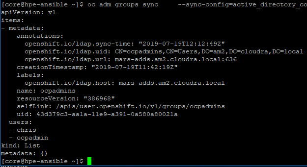

If you are happy with the result, you can enter the same command with the `--confirm` switch

```bash
$ oc adm groups sync \
    --sync-config=active_directory_config.yml \
    'CN=ocpadmins,CN=Users,DC=am2,DC=cloudra,DC=local' --confirm
```

Use the same command to import the `ocpusers` group from LDAP

```bash
$ oc adm groups sync \
   --sync-config=active_directory_config.yml \
   'CN=ocpusers,CN=Users,DC=am2,DC=cloudra,DC=local' --confirm
```

### Verifications

You can verify that your groups are here as well as their content with the following commands: (provided you used the same group names)

```bash
$ oc get group ocpadmins -o yaml
$ oc get group ocpusers -o yaml
```

### More information

Currently only the OCP 3.11 documentation covers LDAP groups synchronization. You can find this topic covered [here](https://docs.openshift.com/container-platform/3.11/install_config/syncing_groups_with_ldap.html).

## Adding a cluster Administrator

**Prerequisites:**

1. You have cluster admin credentials. You would typically be using the `kubeconfig` file created during the deployment of the control plane. This kubeconfig file is located in your installation directory (see the variable `group_vars/all/vars.yml:install_dir`)
2. You have configured an identity provider
3. You have created a group called `ocpadmins` and this group is populated with the people which should be cluster administrators

In the remaining of this paragraph, we will continue to use our sample Active Directory integration which means that we have a group called `ocpadmins`.

If your `install_dir` is pointing to the .ocp folder under your home directory, then you should export KUBECONFIG like this:

```bash
$ export KUBECONFIG=~/.ocp/auth/kubeconfig
```

Make sure you have cluster-admin privilege by login in with `kubeadmin`. The password is stored in `<install_dir>/auth/kubeadmin-password`.

Login with kubeadmin, you will be prompted for the password

```bash
$ oc login -u kubeadmin
```

Assign the cluster-admin role to the `ocpadmins` group

```bash
$ oc adm policy add-cluster-role-to-group cluster-admin ocpadmins
```

Now all users in the `ocpadmins` group are cluster administrators. Red Hat recommends you disable the `kubeadmin` account. It is a good opportunity to test your new cluster admin account. In the example below, we use the `ocpadmin` account which is a member of our `ocpadmins` group.

```bash
$ oc login -u ocpadmin
$ oc delete secret kubeadmin -n kube-system
```

# Scaling the resource plane with additional Worker nodes

Once the OpenShift cluster is successfully deployed, you can scale up the cluster with additional worker nodes. These worker nodes are used for scheduling application workloads, so the number and size of the worker nodes will depend heavily on the applications deployed in your OCP cluster.

OpenShift 4.1 supports two Operating System variants for the worker nodes: Red Hat Enterprise Linux CoreOS (RHCOS) and Red Hat Enterprise Linux 7.6 (RHEL7).

A separate playbook is provided to scale up the resource plane with additional worker nodes called `playbooks/scale.yml`. This playbook is run separately after the control plane is deployed, and it is used when adding either RHCOS or RHEL7 worker nodes to the cluster.

## Scaling with Red Hat CoreOS Worker nodes

As part of deploying the OpenShift control plane, two RHCOS-based workers are configured by default. These workers are defined in the `rhcos_worker` group in the `hosts` inventory file:

```bash
[rhcos_worker]
hpe-worker0   ansible_host=10.15.152.213
hpe-worker1   ansible_host=10.15.152.214
```

Additional RHCOS worker nodes can be deployed by adding entries to the `rhcos_worker` section of the inventory file and running the `playbooks/scale.yml` playbook.

For example, to deploy two additional RHCOS worker nodes to the cluster (`hpe-worker2` and `hpe-worker3`), update the `rhcos_worker` section of the `hosts` file with the required entries for these worker nodes:

```bash
[rhcos_worker]
hpe-worker0   ansible_host=10.15.152.213
hpe-worker1   ansible_host=10.15.152.214
hpe-worker2   ansible_host=10.15.152.215
hpe-worker3   ansible_host=10.15.152.216
```

Then run the Ansible playbook to deploy the new worker nodes:

```bash
$ cd ~/OpenShift-on-SimpliVity
$ ansible-playbook -i hosts playbooks/scale.yml --vault-password-file .vault_pass
```

Once the playbook completes, the newly created RHCOS worker nodes will automatically join the cluster after a few minutes (1 or 2) . You can verify the nodes in the OCP cluster using the following command:

```bash
$ watch -n5 oc get nodes
```

If you were fast enough, the new nodes are not listed.

```bash
Every 5.0s: oc get node                                                                                                                     hpe-ansible: Fri Aug 23 16:23:58 2019

NAME          STATUS   ROLES    AGE     VERSION
hpe-master0   Ready    master   3h53m   v1.13.4+d81afa6ba
hpe-master1   Ready    master   3h53m   v1.13.4+d81afa6ba
hpe-master2   Ready    master   3h53m   v1.13.4+d81afa6ba
hpe-worker0   Ready    worker   3h53m   v1.13.4+d81afa6ba
hpe-worker1   Ready    worker   3h53m   v1.13.4+d81afa6ba
```

After a few seconds, new worker nodes appear in the listing with a STATUS of `NotReady`.

```bash
Every 5.0s: oc get node                                                                                                                     hpe-ansible: Fri Aug 23 16:24:49 2019

NAME          STATUS     ROLES    AGE     VERSION
hpe-master0   Ready      master   3h54m   v1.13.4+d81afa6ba
hpe-master1   Ready      master   3h54m   v1.13.4+d81afa6ba
hpe-master2   Ready      master   3h54m   v1.13.4+d81afa6ba
hpe-worker0   Ready      worker   3h54m   v1.13.4+d81afa6ba
hpe-worker1   Ready      worker   3h54m   v1.13.4+d81afa6ba
hpe-worker2   NotReady   worker   8s      v1.13.4+d81afa6ba
hpe-worker3   NotReady   worker   10s     v1.13.4+d81afa6ba
```

After one minutes or two the STATUS of the new worker nodes transitions from `NotReady` to `Ready`.

```bash
Every 5.0s: oc get node                                                                                                                     hpe-ansible: Fri Aug 23 16:26:52 2019

NAME          STATUS   ROLES    AGE     VERSION
hpe-master0   Ready    master   3h56m   v1.13.4+d81afa6ba
hpe-master1   Ready    master   3h56m   v1.13.4+d81afa6ba
hpe-master2   Ready    master   3h56m   v1.13.4+d81afa6ba
hpe-worker0   Ready    worker   3h56m   v1.13.4+d81afa6ba
hpe-worker1   Ready    worker   3h56m   v1.13.4+d81afa6ba
hpe-worker2   Ready    worker   2m11s   v1.13.4+d81afa6ba
hpe-worker3   Ready    worker   2m13s   v1.13.4+d81afa6ba
```

Type Ctrl-C to stop the `watch` command.

## Scaling with Red Hat Enterprise Linux 7.6 Worker nodes

**Note:** As a reminder, configuring RHEL7 worker nodes can only be performed **after** the OpenShift control plane is successfully deployed and the OCP cluster is up and running.

The procedure to add RHEL7 worker nodes is slightly different from the process used to deploy RHCOS worker nodes. The `scale.yml` Ansible playbook is used as before to prepare the RHEL7 VMs. Then the `openshift-ansible` playbooks are used to configure these VMs as OCP worker nodes and join them to the cluster.

The `openshift-ansible` playbooks are not owned or maintained by HPE, and the contents of these playbooks are changing rapidly as OpenShift development progresses. HPE therefore recommends using a specific version of the `openshift-ansible` playbooks rather than the version of the playbooks found on the `master` branch. As of the time of this writing, the `4.1.11-201908060314` version of the playbooks have been tested and certified with this solution.

The following procedure outlines the steps involved in adding RHEL7 worker nodes to the OCP cluster:

- Clone the `4.1.11-201908060314` branch of the `openshift-ansible` playbooks into the home directory of the "core" user on the Ansible controller node:

```bash
$ pwd
/home/core

$ git clone --branch openshift-ansible-4.1.11-201908060314 https://github.com/openshift/openshift-ansible.git
```

- Ensure the `ocp_repo_directory` variable (located in `group_vars/all/vars.yml`) accurately reflects the location of the `openshift-ansible` playbooks cloned in the previous step. By default this parameter is set to: `{{ local_home }}/openshift-ansible` so it should not require modification if the playbooks were cloned in the core user's home directory as instructed.

- Ensure the `template` and `ova_path` variables in the `group_vars/rhel_worker.yml` file accurately reflect the name and location of the Red Hat Enterprise Linux 7.6 OVA file and template in your environment.

```bash
template: hpe-rhel760              # Override the default template
ova_path: /kits/hpe-rhel760.ova    # Name of the OVA used to import the template
```

- Modify the Ansible inventory file `hosts` to add entries under the `[rhel_worker]` section. For example, in the below `hosts` file the `hpe-worker4` node will be added as a RHEL7 worker:

```bash
[master]
hpe-master0   ansible_host=10.15.153.210
hpe-master1   ansible_host=10.15.153.211
hpe-master2   ansible_host=10.15.153.212

[rhcos_worker]
hpe-worker0   ansible_host=10.15.153.213
hpe-worker1   ansible_host=10.15.153.214
hpe-worker2   ansible_host=10.15.152.215
hpe-worker3   ansible_host=10.15.152.216

[rhel_worker]
hpe-worker4   ansible_host=10.15.153.217
```

- Prepare the RHEL7 worker node VM(s) by invoking the `playbooks/scale.yml` playbook:

```bash
$ cd ~/OpenShift-on-SimpliVity
$ ansible-playbook -i hosts playbooks/scale.yml --vault-password-file .vault_pass
```

- The final step of the `scale.yml` playbook creates a customized Ansible inventory file in the `openshift-ansible` directory called `inventory.scale`. This inventory file contains a list of the newly requested RHEL7 worker nodes that were configured in the `hosts` inventory file. In the above example, the `inventory.scale` file will contain `hpe-worker4`.

- Deploy the RHEL7 worker node(s) by invoking the `playbooks/scaleup.yml` playbook in the `openshift-ansible` directory:

```bash
$ cd ~/openshift-ansible
$ ansible-playbook -i inventory.scale playbooks/scaleup.yml
```

- Verify the newly created RHEL7 worker node `hpe-worker4` has joined the cluster:

  **Note:** This may take one or two minutes before the new nodes are listed in the cluster.

```bash
$ oc get nodes -o wide

NAME          STATUS   ROLES    AGE     VERSION             INTERNAL-IP     EXTERNAL-IP     OS-IMAGE                                                   KERNEL-VERSION               CONTAINER-RUNTIME
hpe-master0   Ready    master   42m     v1.13.4+d81afa6ba   10.15.153.210   10.15.153.210   Red Hat Enterprise Linux CoreOS 410.8.20190807.0 (Ootpa)   4.18.0-80.7.2.el8_0.x86_64   cri-o://1.13.10-0.1.dev.rhaos4.1.git9e2e1de.el8-dev
hpe-master1   Ready    master   43m     v1.13.4+d81afa6ba   10.15.153.211   10.15.153.211   Red Hat Enterprise Linux CoreOS 410.8.20190807.0 (Ootpa)   4.18.0-80.7.2.el8_0.x86_64   cri-o://1.13.10-0.1.dev.rhaos4.1.git9e2e1de.el8-dev
hpe-master2   Ready    master   43m     v1.13.4+d81afa6ba   10.15.153.212   10.15.153.212   Red Hat Enterprise Linux CoreOS 410.8.20190807.0 (Ootpa)   4.18.0-80.7.2.el8_0.x86_64   cri-o://1.13.10-0.1.dev.rhaos4.1.git9e2e1de.el8-dev
hpe-worker0   Ready    worker   42m     v1.13.4+d81afa6ba   10.15.153.213   10.15.153.213   Red Hat Enterprise Linux CoreOS 410.8.20190807.0 (Ootpa)   4.18.0-80.7.2.el8_0.x86_64   cri-o://1.13.10-0.1.dev.rhaos4.1.git9e2e1de.el8-dev
hpe-worker1   Ready    worker   43m     v1.13.4+d81afa6ba   10.15.153.214   10.15.153.214   Red Hat Enterprise Linux CoreOS 410.8.20190807.0 (Ootpa)   4.18.0-80.7.2.el8_0.x86_64   cri-o://1.13.10-0.1.dev.rhaos4.1.git9e2e1de.el8-dev
hpe-worker2   Ready    worker   43m     v1.13.4+d81afa6ba   10.15.153.215   10.15.153.215   Red Hat Enterprise Linux CoreOS 410.8.20190807.0 (Ootpa)   4.18.0-80.7.2.el8_0.x86_64   cri-o://1.13.10-0.1.dev.rhaos4.1.git9e2e1de.el8-dev
hpe-worker3   Ready    worker   43m     v1.13.4+d81afa6ba   10.15.153.216   10.15.153.216   Red Hat Enterprise Linux CoreOS 410.8.20190807.0 (Ootpa)   4.18.0-80.7.2.el8_0.x86_64   cri-o://1.13.10-0.1.dev.rhaos4.1.git9e2e1de.el8-dev
hpe-worker4   Ready    worker   63s     v1.13.4+d81afa6ba   10.15.153.217   10.15.153.217   OpenShift Enterprise                                       3.10.0-1062.el7.x86_64       cri-o://1.13.9-1.rhaos4.1.gitd70609a.el7
```

- In the above output the `OS-IMAGE`, `KERNEL-VERSION`, and `CONTAINER-RUNTIME` values are different for worker node `hpe-worker4`, confirming this is a RHEL7 worker node.

**Note:** It takes 10 to 15mns to deploy two Red Hat Enterprise Linux worker nodes

# External routes

## Why external routes matter

Users of the OpenShift cloud you just deployed typically will not have access to the backend network. Rather, they will access the applications deployed on the cloud over a frontend network. This is illustrated by the figure below:

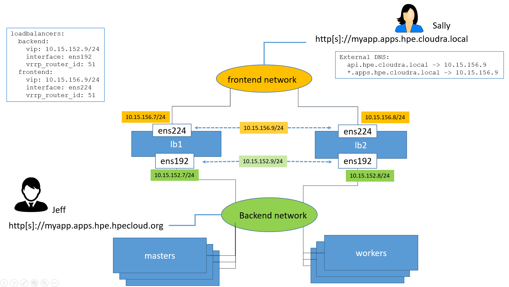

Out of the box, built-in applications can be accessed by internal users (such as Jeff in the diagram above) via the backend network. An example of that is the OpenShift console which can be found at `htts://console-openshift-console.apps.hpe.hpecloud.org` assuming the cluster was deployed with `domain_name: hpecloud.org` and `cluster_name: hpe`.

In this example, external users like Sally use the domain name `cloudra.local` to access resources and services provided by the IT organization. `hpe.cloudra.local` is a DNS zone used to manage records pertaining to this specific cluster.

In order to achieve the above, the DNS resolver that Sally is using must have the following DNS records defined:

- `api.hpe.cloudra.local` must resolve to the VIP of the load balancer on the frontend network. In this example, this is 10.15.156.9. This is needed if external users want to use the OpenShift API (including the `oc` command).
- A wildcard record must be created in the `hpe.cloudra.local` domain for `*.apps`. This record points to the same VIP (10.15.156.9). With this setup, names such as `myapp.apps.hpe.cloudra.local` or `myotherapp.apps.hpe.cloudra.local` all resolve to 10.15.156.9.

**IMPORTANT:** The playbook will not configure external DNS servers for you. The DNS administrator must configure these entries.

In our above example, the DNS administrator maintains a zone for `hpe.cloudra.local` with the following records:

```bash
;
;  Zone records
;
api                     A   10.15.156.9
*.apps                  A   10.15.156.9
```

The load balancers (lb1 and lb2 in this example) are configured to forward port 80 and port 443 to all the worker nodes in the OCP cluster. Strictly speaking, the load balancers should only have to forward port 80 and 443 to the worker nodes which are hosting an OpenShift router replica but the solution configures all worker nodes in case a router replica is relocated.

When user Sally accesses <http://myapp.hpe.cloudra.local> or <https://myapp.hpe.cloudra.local>, the packets are forwarded to one of the worker nodes hosting a router replica.

For the router replica to direct the packets to the correct application running inside the cluster (i.e. somewhere in the pool of worker nodes) an external route must be created.

**Note:** The following example will walk you through the process of creating a simple application and exposing it on the frontend network so that external users can access it. This is not meant to replace the official OpenShift documentation.

## Create a simple application

There are many different ways you can create and deploy an application. That subject is outside the scope of this document. In this example we use the OpenShift CLI `oc` to deploy the NGINX application. The code snippet below should help absolute beginners getting started with deploying applications on OpenShift. Note that you need to authenticate yourself with the cluster first and provide credentials. You can use the `kubeadmin` user if you did not delete it or an account with sufficient privileges.

```bash
$ oc login
(enter username and password)
$ oc new-project myapp
$ oc new-app --template=openshift/nginx-example --name=myapp --param=NAME=myapp
```

Wait for the application to be fully deployed. You can use `oc status` to monitor the application deployment.

Once the application is fully deployed you should be able to browse to `http://myapp-myapp.apps.<cluster_name>.<domain_name>` where you replace <cluster_name> and <domain_name> with the values specified in `group_vars/all/vars.yml` for the <cluster_domain> and <domain_name> variables. The cluster in this example was deployed with `cluster_name: hpe` and `domain_name: hpecloud.org`.

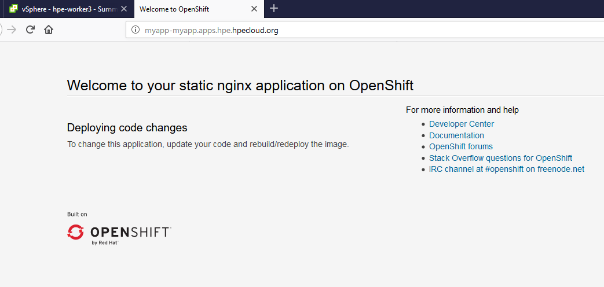

In order for this to work, an OpenShift route was created by the `oc new-app` command. This can be verified with `oc get all` or `oc get routes` commands.

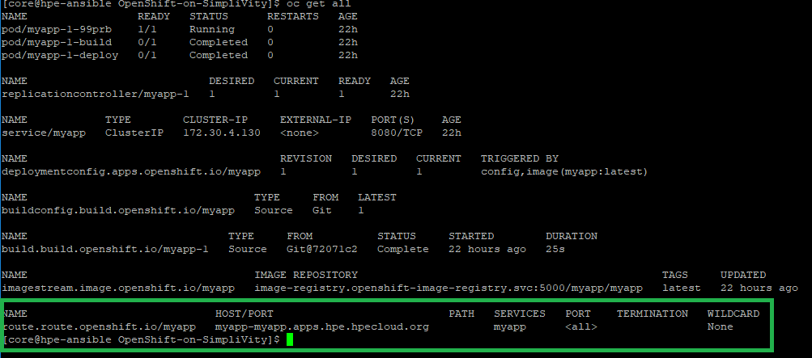

## Create an Ingress object for the application

If user Jeff can now access our application, this is not necessarily the case for user Sally because her external DNS server does not resolve hpecloud.org which is only known inside the IT organization operating the cluster. Sally should access the cluster via the frontend network using application name in the form `*.apps.hpe.cloudra.local`. In order for this to works we need to create an OpenShift/Kubernetes object called an `Ingress` object. This object will be created with the following characteristics which are stored in a temporary file.

```bash
apiVersion: extensions/v1beta1
kind: Ingress
metadata:
  name: myapp
  namespace: myapp
spec:
  rules:
  - host: myapp.apps.hpe.cloudra.local
    http:
      paths:
      - backend:
          serviceName: myapp
          servicePort: 8080
        path: /
```

**Note:** The service name is the name of the service which was created when the application was built (see screenshot above).

The first command below creates the Ingress object, the second verifies that an additional route was created:

```bash
$ oc apply -f <path_to_ingress_file_above>
$ oc get routes
```

In the screenshot below we verify that a new route was created (`myapp-xxxxx`) with the hostname we expect:

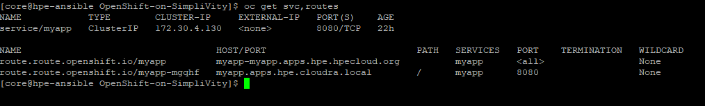

Sally can now reach our simple application at <https://myapp.apps.hpe.cloudra.local>.

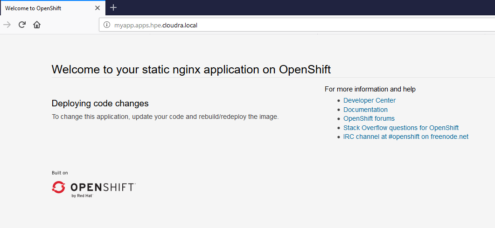

# Backup and Restore

A backup of the `etcd cluster` can be taken using the `backup_etcd.yml` playbook. Before you use this playbook you should do the following:

1. Populate the `group_vars/all/vars.yml` file with backup-related variables
2. Login to the OCP cluster using an account with cluster-admin privileges

## Configuring Backup

Edit the file `group_vars/vars/all.yml` and configure the backup-related variables as indicated below:

| Variable Name    | Purpose                                                      |
| ---------------- | ------------------------------------------------------------ |
| backup_directory | Directory on the Ansible controller where the backup files are stored. This directory is created if it does not exist. |
| backup_artifacts | A list of files or directories on the Ansible controller you wish to include in the etcd snapshots. In the example, the contents of the `install_dir` directory are backed up, as well as the contents of the  `group_vars` folder and the Ansible inventory file `hosts`. File paths are relative to the location of the playbook. |

In the example below, the backup files will be stored in $HOME/backups, where $HOME is the home directory of the user running the Ansible playbook. In addition to the `etcd` snapshot files collected from each running master node, the contents of the `install_dir` directory, the `group_vars` directory and the `hosts` file from the Ansible controller will be saved as well.

```bash
#
# backup related settings
#
backup_directory: "{{ local_home }}/backups"
backup_artifacts:
- "{{ install_dir }}"
- ./group_vars/
- ./hosts
```

## Running backup_etcd.yml

First make sure you are connected to the OCP cluster with a user who is granted cluster-admin privileges:

```bash
$ oc login -u <user>
```

Then cd to the folder were you cloned the OpenShift-on-SimpliVity repository:

```bash
$ cd <Your clone of the repository>
```

Then run the playbook:

```bash
$ ansible-playbook -i hosts backup_etcd.yml
```

## Backup files

The playbook `backup_etcd.yml` creates two files which are stored in the folder designated by the `backup_directory` variable. Both files are stored in .tgz format (compressed tar file).  The first file contains snapshots of the `etcd` cluster taken from each master node found operational (Ready) at the time the playbook was run. The `misc` file contains the files and directories on the Ansible controller that are specified in the `backup_artifacts` variable. The backup file names are created according to the following pattern:

```bash
backup_<timestamp>.<type>.tgz
```

where `<timestamp>` is the timestamp taken when the playbook was run (as seen on the Ansible controller) and `<type>` is either `snapshots` or `misc`.

Below is a sample listing of a .snapshots.tgz file collected on an OCP cluster with three running master nodes `hpe-master0`, `hpe-master1`, and `hpe-master2`:

```bash
$ tar -tvf backup_2019_09_04_075703.snapshots.tgz
drwxrwxr-x core/core         0 2019-09-04 07:57 hpe-master2/
drwxrwxr-x core/core         0 2019-09-04 07:57 hpe-master0/
drwxrwxr-x core/core         0 2019-09-04 07:57 hpe-master1/
drwxrwxr-x core/core         0 2019-09-04 07:57 hpe-master2/assets/
drwxrwxr-x core/core         0 2019-09-04 07:57 hpe-master2/assets/backup/
-rw-rw-r-- core/core  55435296 2019-09-04 07:57 hpe-master2/assets/backup/snapshot.db
-rw-rw-r-- core/core      6083 2019-09-04 07:57 hpe-master2/assets/backup/etcd-member.yaml
-rw-rw-r-- core/core      1675 2019-09-04 07:57 hpe-master2/assets/backup/etcd-client.key
-rw-rw-r-- core/core      1188 2019-09-04 07:57 hpe-master2/assets/backup/etcd-client.crt
-rw-rw-r-- core/core      1135 2019-09-04 07:57 hpe-master2/assets/backup/etcd-ca-bundle.crt
drwxrwxr-x core/core         0 2019-09-04 07:57 hpe-master0/assets/
drwxrwxr-x core/core         0 2019-09-04 07:57 hpe-master0/assets/backup/
-rw-rw-r-- core/core  55525408 2019-09-04 07:57 hpe-master0/assets/backup/snapshot.db
-rw-rw-r-- core/core      6083 2019-09-04 07:57 hpe-master0/assets/backup/etcd-member.yaml
-rw-rw-r-- core/core      1675 2019-09-04 07:57 hpe-master0/assets/backup/etcd-client.key
-rw-rw-r-- core/core      1188 2019-09-04 07:57 hpe-master0/assets/backup/etcd-client.crt
-rw-rw-r-- core/core      1135 2019-09-04 07:57 hpe-master0/assets/backup/etcd-ca-bundle.crt
drwxrwxr-x core/core         0 2019-09-04 07:57 hpe-master1/assets/
drwxrwxr-x core/core         0 2019-09-04 07:57 hpe-master1/assets/backup/
-rw-rw-r-- core/core  55365664 2019-09-04 07:57 hpe-master1/assets/backup/snapshot.db
-rw-rw-r-- core/core      6083 2019-09-04 07:57 hpe-master1/assets/backup/etcd-member.yaml
-rw-rw-r-- core/core      1675 2019-09-04 07:57 hpe-master1/assets/backup/etcd-client.key
-rw-rw-r-- core/core      1188 2019-09-04 07:57 hpe-master1/assets/backup/etcd-client.crt
-rw-rw-r-- core/core      1135 2019-09-04 07:57 hpe-master1/assets/backup/etcd-ca-bundle.crt
```

## Restore

`etcd` snapshot files can be used to recover from the following scenarios:

- Recovering from lost master hosts: The recovery procedure is documented here: <https://docs.openshift.com/container-platform/4.1/disaster_recovery/scenario-1-infra-recovery.html>
- Restoring back to a previous cluster state. This is documented here: <https://docs.openshift.com/container-platform/4.1/disaster_recovery/scenario-2-restoring-cluster-state.html>

(to be completed)

# Cluster Logging

As an OpenShift Container Platform cluster administrator, you can deploy cluster logging to aggregate logs for a range of OpenShift Container Platform services.

## About cluster logging

The cluster logging components are based upon the `Elasticsearch`, `Fluentd`, and `Kibana` (EFK) tools.

The collector component, `Fluentd`, is deployed to each node in the OpenShift Container Platform cluster. It collects all node and container logs and sends them to `Elasticsearch` (ES). `Kibana` is the centralized, web UI where users and administrators can create rich visualizations and dashboards with the aggregated data.

OpenShift Container Platform cluster administrators can deploy the cluster logging stack using an HPE-provided Ansible playbook called `playbooks/efk.yml`. This playbook automates the installation of the Elasticsearch Operator and the Cluster Logging Operator. When the operators are installed, it creates a Cluster Logging Custom Resource (CR) to schedule cluster logging pods and other resources necessary to support cluster logging. The operators are responsible for deploying, upgrading, and maintaining cluster logging.

For more information about the OpenShift Cluster Logging facility, see: <https://docs.openshift.com/container-platform/4.1/logging/efk-logging.html>.

## Deploying the Cluster Logging (EFK) stack

Elasticsearch is a memory-intensive application. Each Elasticsearch node needs 16G of memory and additional CPU limits. The initial set of OpenShift Container Platform nodes might not be large enough to support the Elasticsearch cluster. You must add additional nodes to the OpenShift Container Platform cluster to run with the recommended or higher memory limits. Each Elasticsearch node can operate with a lower memory setting though this is not recommended for production deployments.

The example `hosts.sample` inventory file that ships with the OpenShift-on-SimpliVity playbooks includes entries used to create three CoreOS worker nodes with higher CPU and RAM limits (`hpe-worker2`, `hpe-worker3`, `hpe-worker4`):

```bash
[rhcos_worker]
hpe-worker0   ansible_host=10.15.152.213
hpe-worker1   ansible_host=10.15.152.214
hpe-worker2   ansible_host=10.15.152.215  cpus=8 ram=32768  k8s_labels='{"node-role.kubernetes.io/infra":"","mylabel":"myvalue"}'
hpe-worker3   ansible_host=10.15.152.216  cpus=8 ram=32768  k8s_labels='{"node-role.kubernetes.io/infra":"","mylabel":"myvalue"}'
hpe-worker4   ansible_host=10.15.152.217  cpus=8 ram=32768  k8s_labels='{"node-role.kubernetes.io/infra":"","mylabel":"myvalue"}'
```

In the above example, each of these "large" CoreOS worker nodes will be allocated `8` virtual CPU cores and `32GB` of RAM. These values override the default limits of 4 virtual CPU cores and 16GB RAM defined in the `group_vars/worker.yml` file. The above example also shows how custom Kubernetes labels can be configured on a per-node basis. For more information about labels and workload placement, refer to the "Workload placement" section later in this document.

By default, the cluster logging services are deployed with no limits on their CPU and RAM resources. If you wish to limit the CPU and memory resources consumed by the elasticsearch, kibana, curator, and fluentd resources you can edit the `playbooks/roles/efk/templates/clo-crd.yml.j2` file. This Jinja2 template file has many commented lines that offer examples of how to restrict the CPU and RAM resources for each of these services.

A persistent volume is required for each Elasticsearch deployment to have one data volume per data node. On OpenShift Container Platform this is achieved using Persistent Volume Claims (PVC) and Persistent Volumes (PV). You can customize both the Storage Class and Size of the Persistent Volumes (PV) used to store Elasticsearch data by editing the following variables in the `playbooks/roles/efk/vars/main.yml` file:

| Variable Name           | Purpose               |
| ----------------------- | --------------------- |
| efk_es_pv_size          | Size of the Persistent Volume used to hold Elasticsearch data (default size is `'200G'`) |
| efk_es_pv_storage_class | The Storage Class to use when creating Elasticsearch Persistent Volumes (default storage class name is `'thin'`) |

After making the appropriate customizations to the above variables, deploy the EFK stack by changing into the directory where you cloned the OpenShift-on-SimpliVity repository:

```bash
$ cd ~/OpenShift-on-SimpliVity
```

and then running the playbook:

```bash
$ ansible-playbook -i hosts playbooks/efk.yml
```

The playbook takes approximately 1-2 minutes to complete.  However, it may take several additional minutes for the various Cluster Logging components to successfully deploy to the OpenShift Container Platform cluster.

## Verify the Cluster Logging installation

To verify the Cluster Logging installation:

- Switch to the `Workloads → Pods` page
- Select the `openshift-logging` project

You should see several pods for cluster logging, Elasticsearch, Fluentd, and Kibana similar to the following list:

- cluster-logging-operator-cb795f8dc-xkckc
- elasticsearch-cdm-b3nqzchd-1-5c6797-67kfz
- elasticsearch-cdm-b3nqzchd-2-6657f4-wtprv
- elasticsearch-cdm-b3nqzchd-3-588c65-clg7g
- fluentd-2c7dg
- fluentd-9z7kk
- fluentd-br7r2
- fluentd-fn2sb
- fluentd-pb2f8
- fluentd-zqgqx
- kibana-7fb4fd4cc9-bvt4p
- kibana-7fb4fd4cc9-st4cs

## Access the Kibana Dashboard

Once the Cluster Logging instance has deployed successfully a new entry called `Logging` will appear under the `Monitoring` tab of the OpenShift Container Platform dashboard. Selecting the `Logging` entry will launch the Kibana Dashboard in a separate browser tab.

The Kibana dashboard can also be accessed directly at: https://kibana-openshift-logging.apps.`<cluster_name>`.`<domain_name>` where `<cluster_name>` and `<domain_name>` match the `cluter_name` and `domain_name` variables configured in the `group_vars/all/vars.yml` file.

# Persistent Storage for Cluster Monitoring

As an OpenShift Container Platform cluster administrator, you can deploy persistent storage volumes to house the cluster monitoring data collected by your OCP 4.1 cluster.

## About Cluster Monitoring

OpenShift Container Platform 4.1 has built-in support for several cluster monitoring components, including: `Prometheus`, `Grafana`, and `Alertmanager`. When running OCP 4.1 in a non-production or temporary environment (i.e. for Proof of Concepts or as a developer training tool) it is usually not important to configure persistent storage for these components. However, Enterprise customers generally prefer to use persistent storage to maintain a permanent record of these cluster monitoring resources.

For more information about the various cluster monitoring components included with OCP 4.1, see: <https://docs.openshift.com/container-platform/4.1/monitoring/cluster-monitoring/about-cluster-monitoring.html>.

## Configuring Persistent Storage for Cluster Monitoring

OCP cluster administrators can configure persistent storage for the cluster monitoring components using an HPE-provided Ansible playbook called `playbooks/monitoring.yml`. This playbook automates the configuration of persistent storage for the Prometheus and Alertmanager pods.

A separate storage volume is created for each Prometheus and Alertmanager pod. On OpenShift Container Platform this is achieved using Persistent Volume Claims (PVC) and Persistent Volumes (PV). You can customize both the Storage Class and Size of the Persistent Volumes (PV) used to store Prometheus and Alertmanager data by editing the following variables in the `playbooks/roles/monitoring/vars/main.yml` file:

| Variable Name                     | Purpose               |
| --------------------------------- | --------------------- |
| prometheus_pv_size                | Size of the Persistent Volume used to hold Prometheus data (default size is `'40Gi'`) |
| prometheus_pv_storage_class       | The Storage Class to use when creating Prometheus Persistent Volumes (default storage class name is `'thin'`) |
| alertmanager_pv_size              | Size of the Persistent Volume used to hold Alertmanager data (default size is `'40Gi'`) |
| alertmanager_pv_storage_class     | The Storage Class to use when creating Alertmanager Persistent Volumes (default storage class name is `'thin'`) |

After making the appropriate customizations to the above variables, re-deploy the  cluster monitoring components by changing into the directory where you cloned the OpenShift-on-SimpliVity repository:

```bash
$ cd ~/OpenShift-on-SimpliVity
```

and then running the playbook:

```bash
$ ansible-playbook -i hosts playbooks/monitoring.yml
```

The playbook takes approximately 1-2 minutes to complete.  However, it may take several additional minutes for the various Cluster Monitoring components to successfully re-launch with their newly created persistent storage volumes.

# Workload placement

You may want to dedicate a number of worker nodes for management purposes. An example of that is the logging stack. By default, `playbooks/efk.yml` will deploy the elasticsearch and kibana pods on whichever worker node that matches the pods requirements in terms of CPU and memory.  However, you may want to have a better control on the placement of these components.  The best way for doing so is probably to use node labels. 

## Specifying node labels in the Ansible inventory

In order to add labels to OCP nodes you will need to edit your Ansible inventory file and then use the playbook `playbooks/label.yml`.

Let's say you want to dedicate 3 of the worker nodes to OCP workloads such as monitoring, logging, routing, etc.  This type of worker nodes is named Infrastructure node in the OpenShift literature and Kubernetes defines a special role to support infrastructure nodes. This role is assigned to worker nodes by tagging a node with the label `node-role.kubernetes.io/infra`

Let's assume we have just deployed a cluster with 5 worker nodes.  This is how our initial hosts file is looking:

```
[rhcos_worker]
hpe-worker0   ansible_host=10.15.152.213  cpus=8 ram=32768
hpe-worker1   ansible_host=10.15.152.214  cpus=8 ram=32768
hpe-worker2   ansible_host=10.15.152.215  cpus=8 ram=32768
hpe-worker3   ansible_host=10.15.152.216  cpus=8 ram=32768
hpe-worker4   ansible_host=10.15.152.217  cpus=8 ram=32768
```

and what the "oc get node" command outputs:

```
[core@hpe-ansible OpenShift-on-SimpliVity]$ oc get node
NAME          STATUS   ROLES    AGE    VERSION
hpe-master0   Ready    master   141m   v1.13.4+12ee15d4a
hpe-master1   Ready    master   141m   v1.13.4+12ee15d4a
hpe-master2   Ready    master   141m   v1.13.4+12ee15d4a
hpe-worker0   Ready    worker   141m   v1.13.4+12ee15d4a
hpe-worker1   Ready    worker   141m   v1.13.4+12ee15d4a
hpe-worker2   Ready    worker   141m   v1.13.4+12ee15d4a
hpe-worker3   Ready    worker   141m   v1.13.4+12ee15d4a
hpe-worker4   Ready    worker   141m   v1.13.4+12ee15d4a
```

To assign the Infrastructure role to a node, you need to tag this node with the label `node-role.kubernetest.io/infra`. To achieve this, edit the inventory file and specify a variable `k8s_labels` for those nodes you want to tag with a label.

```
[rhcos_worker]
hpe-worker0   ansible_host=10.15.152.213  cpus=8 ram=32768 k8s_labels='{"node-role.kubernetes.io/infra":""}'
hpe-worker1   ansible_host=10.15.152.214  cpus=8 ram=32768 k8s_labels='{"node-role.kubernetes.io/infra":""}'
hpe-worker2   ansible_host=10.15.152.215  cpus=8 ram=32768 k8s_labels='{"node-role.kubernetes.io/infra":""}'
hpe-worker3   ansible_host=10.15.152.216  cpus=8 ram=32768
hpe-worker4   ansible_host=10.15.152.217  cpus=8 ram=32768
```

The Ansible variable `k8s_labels` defines a dictionary in json format. Once you have updated your Ansible inventory, you are ready to use the playbook `playbooks/label.yml`

```
# ansible-playbook -i hosts playbooks/label.com
```

After successful completion of the playbook you can use the oc get node command to verify that you have the nodes you want listed with the "Infra" role.

```
[core@hpe-ansible OpenShift-on-SimpliVity]$ oc get node
NAME          STATUS   ROLES          AGE    VERSION
hpe-master0   Ready    master         152m   v1.13.4+12ee15d4a
hpe-master1   Ready    master         152m   v1.13.4+12ee15d4a
hpe-master2   Ready    master         152m   v1.13.4+12ee15d4a
hpe-worker0   Ready    infra,worker   152m   v1.13.4+12ee15d4a
hpe-worker1   Ready    infra,worker   152m   v1.13.4+12ee15d4a
hpe-worker2   Ready    infra,worker   152m   v1.13.4+12ee15d4a
hpe-worker3   Ready    worker         152m   v1.13.4+12ee15d4a
hpe-worker4   Ready    worker         153m   v1.13.4+12ee15d4a
```

You may want to use custom labels. Have a look at the inventory below:

```
[rhcos_worker]
hpe-worker0   ansible_host=10.15.152.213  cpus=8 ram=32768 k8s_labels='{"node-role.kubernetes.io/infra":"",}'
hpe-worker1   ansible_host=10.15.152.214  cpus=8 ram=32768 k8s_labels='{"node-role.kubernetes.io/infra":"",}'
hpe-worker2   ansible_host=10.15.152.215  cpus=8 ram=32768 k8s_labels='{"node-role.kubernetes.io/infra":"","mylabel":"yes"}'
hpe-worker3   ansible_host=10.15.152.216  cpus=8 ram=32768 k8s_labels='{"mylabel":"yes"}'
hpe-worker4   ansible_host=10.15.152.217  cpus=8 ram=32768 k8s_labels='{"mylabel":"yes"}'
```

Running the playbook `playbooks/label.yml` against the above inventory would assign the labels `mylabel` and `node-roles.kubernetes.io/infra` to the worker nodes, one of them being assigned the two labels. You will need to use the --show-labels switch to view custom labels. The example below shows the labels assigned to the node `hpe-worker2`

```
[core@hpe-ansible OpenShift-on-SimpliVity]$ oc get node --show-labels hpe-worker2
NAME          STATUS   ROLES          AGE    VERSION             LABELS
hpe-worker2   Ready    infra,worker   164m   v1.13.4+12ee15d4a   beta.kubernetes.io/arch=amd64,beta.kubernetes.io/os=linux,kubernetes.io/hostname=hpe-worker2,mylabel=yes,node-role.kubernetes.io/infra=,node-role.kubernetes.io/worker=,node.openshift.io/os_id=rhcos,node.openshift.io/os_version=4.1
```

Note: The playbook will not let you delete existing labels, you will need to do it manually using the oc label command. The generic syntax is shown below. Take note of the - following the name of the label.

```
# oc label node <nodename> <labelname>-
```

## Controlling the placement of infrastructure workloads

The OCP 4.1 documentation describes how you can control the placement of the main infrastructure resources in your cluster. This documentation leverages the label `node-role.kubernetes.io/infra` and hence use a single pool of infrastructure nodes to host all the infrastructure resources. 

### Moving router replicas to infrastructure nodes

Click [here](https://docs.openshift.com/container-platform/4.1/machine_management/creating-infrastructure-machinesets.html#infrastructure-moving-router_creating-infrastructure-machinesets) to learn how you can control the placement of the router replicas. If you have already configured your pool of infrastructure nodes (using the label `node-role.kubernetes.io/infra` label as explained above) these instructions can be summarized with a single `oc patch` command

```
# oc patch ingresscontroller/default --type=merge -n openshift-ingress-operator -p '{"spec": {"nodePlacement":{"nodeSelector":{"matchLabels":{"node-role.kubernetes.io/infra": ""}}}}}'
```

**note**: The data passed to the patch command above with the -p switch depends on the type of resource being patched. The `ingresscontroller` resource is a custom resource and the spec properties that can be specified for such resource objects can be found by querying the corresponding custom resource definition (CRD) `ingresscontrollers.operator.openshift.io`.

Once you have patched the default ingress controller, you can type the following command to verify the placement of the router pods:

```
# oc get pod -n openshift-ingress -o wide
```

It may take a while (seconds) before all the router replicas are migrated to your pool of infrastructure nodes (hpe-worker0, hpe-worker1 and hpe-worker2 in our example)

```
[core@hpe-ansible OpenShift-on-SimpliVity]$ oc get pods -n openshift-ingress -o wide
NAME                              READY   STATUS    RESTARTS   AGE   IP              NODE          NOMINATED NODE   READINESS GATES
router-default-766d49447f-9rqxc   1/1     Running   0          40s   10.15.152.214   hpe-worker1   <none>           <none>
router-default-766d49447f-pszjl   0/1     Running   0          18s   10.15.152.213   hpe-worker0   <none>           <none>
```

### Moving the registry to infrastructure nodes

Click [here](https://docs.openshift.com/container-platform/4.1/machine_management/creating-infrastructure-machinesets.html#infrastructure-moving-registry_creating-infrastructure-machinesets) to learn how you can control the placement of the registry. 

### Moving the monitoring resources to infrastructure nodes

Click [here](https://docs.openshift.com/container-platform/4.1/machine_management/creating-infrastructure-machinesets.html#infrastructure-moving-monitoring_creating-infrastructure-machinesets) to learn how you can control the placement of the monitoring resources

### Moving the cluster logging resources to infrastructure nodes

Click [here](https://docs.openshift.com/container-platform/4.1/machine_management/creating-infrastructure-machinesets.html#infrastructure-moving-logging_creating-infrastructure-machinesets) to learn how you can control the placement of the logging resources.  If you have already configured your pool of infrastructure nodes (using the label `node-role.kubernetes.io/infra` label as explained above) these instructions can be summarized with a single `oc patch` command which moves the `curator`, `logStore`, and `visualization` pods to the pool of infrastructure nodes you defined when assigning the `node-role.kubernetes.io/infra` label.

```
# oc patch --type=merge  -n openshift-logging clusterlogging/instance -p '{"spec":{"curation":{"curator":{"nodeSelector":{"node-role.kubernetes.io/infra":""}}},"logStore":{"elasticsearch":{"nodeSelector":{"node-role.kubernetes.io/infra":""}}},"visualization":{"kibana":{"nodeSelector":{"node-role.kubernetes.io/infra":""}}}}}'
```

**note**: The data passed to the patch command above with the -p switch depends on the type of resource being patched. The `clusterlogging` resource is a custom resource and the spec properties that can be specified for such resource objects can be found by querying the corresponding custom resource definition (CRD) `clusterloggings.logging.openshift.io`.

The listing below shows the distribution of the EFK pods **before** patching the `clusterlogging` instance. Some of the pods are running on non infrastructure OCP nodes

```
NAME                                            READY   STATUS      RESTARTS   AGE    IP            NODE          NOMINATED NODE   READINESS GATES
curator-1570107600-fkwkh                        0/1     Completed   0          9m2s   10.128.2.20   hpe-worker3   <none>           <none>
elasticsearch-cdm-ioj7ixl8-1-686654c497-7kg4l   2/2     Running     0          111m   10.128.0.9    hpe-worker2   <none>           <none>
elasticsearch-cdm-ioj7ixl8-2-69675b94d4-jgkqq   2/2     Running     0          111m   10.130.0.10   hpe-worker1   <none>           <none>
elasticsearch-cdm-ioj7ixl8-3-66ccb8954f-2v26w   2/2     Running     0          111m   10.129.0.10   hpe-worker4   <none>           <none>
kibana-6c67d99996-27zzj                         2/2     Running     0          111m   10.128.0.7    hpe-worker2   <none>           <none>
kibana-6c67d99996-rffxw                         2/2     Running     0          111m   10.128.2.8    hpe-worker3   <none>           <none>
```

The listing below shows the distribution of the EFK pods **after** patching the `clusterlogging` instance. All visualization, logStore and curator pods are running on Infrastructure nodes now as requested

```
[core@hpe-ansible OpenShift-on-SimpliVity]$ oc get pod -n openshift-logging -o wide | grep -E 'curator|elasticsearch|kibana'
curator-1570108200-4gnpn                        0/1     Completed   0          7m17s   10.129.2.14   hpe-worker0   <none>           <none>
elasticsearch-cdm-ioj7ixl8-1-78c9fc886b-snwv4   2/2     Running     0          6m55s   10.128.0.10   hpe-worker2   <none>           <none>
elasticsearch-cdm-ioj7ixl8-2-bf879f995-qc2c7    2/2     Running     0          5m6s    10.130.0.12   hpe-worker1   <none>           <none>
elasticsearch-cdm-ioj7ixl8-3-5bdb9b86c8-5g6ws   2/2     Running     0          2m42s   10.129.2.15   hpe-worker0   <none>           <none>
kibana-7567cc5b7f-gwnqq                         2/2     Running     0          7m20s   10.129.2.13   hpe-worker0   <none>           <none>
kibana-7567cc5b7f-zf5gz                         2/2     Running     0          6m29s   10.130.0.11   hpe-worker1   <none>           <none>
```

```
[core@hpe-ansible OpenShift-on-SimpliVity]$ oc get node
NAME          STATUS   ROLES          AGE     VERSION
hpe-master0   Ready    master         3h44m   v1.13.4+12ee15d4a
hpe-master1   Ready    master         3h44m   v1.13.4+12ee15d4a
hpe-master2   Ready    master         3h44m   v1.13.4+12ee15d4a
hpe-worker0   Ready    infra,worker   3h44m   v1.13.4+12ee15d4a
hpe-worker1   Ready    infra,worker   3h44m   v1.13.4+12ee15d4a
hpe-worker2   Ready    infra,worker   3h44m   v1.13.4+12ee15d4a
hpe-worker3   Ready    worker         3h44m   v1.13.4+12ee15d4a
hpe-worker4   Ready    worker         3h44m   v1.13.4+12ee15d4a
```


# Appendices

## group_vars/all/vars.yml

The file `group_vars/all/vars.sample` contains the list of Ansible variables that you should configure to match your environment. This file comes with plenty of comments

<https://github.com/HewlettPackard/OpenShift-on-SimpliVity/blob/master/group_vars/all/vars.yml.sample>

## group_vars/all/vault.yml

all keys here are properties of the dictionary called **vault.**

| key                     | example value          | comment                                                      |
| :---------------------- | :--------------------- | :----------------------------------------------------------- |
| vcenter_password        | 'yourpassword'         | This is the password for the vCenter admin user specified with vcenter_username in group_vars/all/vars.yml |
| simplivity_password     | 'yourpassword'         | Typically the same as above                                  |
| rhn_orgid               | '012345678'            | Organization ID in the Red Hat customer portal. Use together with the `rhn_key` variable.  When using the combination of `rhn_orgid` and `rhn_key` you **must** set the `rhn_user` and `rhn_pass` variables to **''**. The specified activation key **must** be associated with a valid OpenShift subscription. |
| rhn_key                 | 'ActivationKey'        | An existing activation key in the organization specified above. |
| rhn_user                | 'RHNetworkUsername'     | If you are not using activation keys, you may specify your username for the Red Hat Network. When using the combination of `rhn_user` and `rhn_pass` you **must** set the `rhn_orgid` and `rhn_key` variables to **''**. The specified user **must** be associated with a valid OpenShift subscription. |
| rhn_pass                | 'RHNetworkPassword'     | Password for the user specified with `rhn_user`.             |
| pull_secret             | 'yourpullsecrethere'   | See the about [pull secret and ssh key](https://confluence.simplivt.local/display/PE/Installing+OCP+4.1+released+version#InstallingOCP4.1releasedversion-pullsecret) |
| ssh_key                 | 'yourSSHpublickeyhere' | See the about [pull secret and ssh key](https://confluence.simplivt.local/display/PE/Installing+OCP+4.1+released+version#InstallingOCP4.1releasedversion-pullsecret) |
| ldap_bind_user_password | 'BindPassword'         | The password of the Bind DN user when integrating with an LDAP Directory |

## Inventory

The file <https://github.com/HewlettPackard/OpenShift-on-SimpliVity/blob/master/hosts.sample> contains an example inventory. The IP used in this inventory are inline with the settings documented in the group_vars/all/vars.yml.sample (dhcp_subnet and gateway)

## Environment

The environment consists of a 4-node SimpliVity cluster running the latest OmniStack bits at the time of testing

- Hardware Model: HPE SimpliVity 380 Series 6000
- OmniStack 3.7.10 (PSI18)
- ESXi 6.7 EP 05 10764712
- vCenter 6.7U2c 

## Monitoring the deployment

The playbooks that powers on the OCP machines monitors port 22 for the non-OCP VMs and port 22623 to assess the successful “ignition” of the OpenShift cluster.

You can monitor the progress of the ignition process in several places:

- After powering on the OCP VMs, the playbook repeatedly polls specific ports on the OCP machines and displays a line per retry for each machine being polled so that you know that it is not stuck. To be specific, the playbook first polls ports 22 on all OCP machines, then when all OCP machines have their port 22 up and running, it polls ports 22 and 22623 depending on the machine role.

  **Note:** In my environment, the playbook finishes at 70 / 60 retries remaining.

- You should see the `openshift-api-server` and the `machine-config-server` endpoints available on the bootstrap machine. Use the Load Balancer stats screen to check this out (URL [<http://your‑internal-lb-ip-address:9000>](<http://yourlb-ip-address:9000>))

- SSH to the bootstrap VM and run the following command:

  `journalctl -b -f -u bootkube.service`

  When something is wrong, the bootstrap VM waits endlessly for the etcd cluster to come online. The documentation gives a few hints on how to troubleshoot ignition.

- Several minutes after all the VMS have been powered on (you don’t have anything to do), the `bootkube.service` service completes successfully. You can view this using the same `journalctl` command as in the previous step from the bootstrap VM.

- It may take a while before all the endpoints are up in the Load Balancer Stats screen. The `site.yml` playbook finishes when all these endpoints are successfully polled. Note that the `openshift-api-server` and `machine-config-server` endpoints for the bootstrap machine are down. This is expected,

- typical elapsed time for the `site.yml` playbook to finish is 30mns.

## LDAP sample ldap_cr.yml

This appendix describes the sample `ldap_cr.yml` shipped with this repository and explains it. Remember that this file will not work in your environment so you will have to edit it. The example was using Active Directory as the directory service.

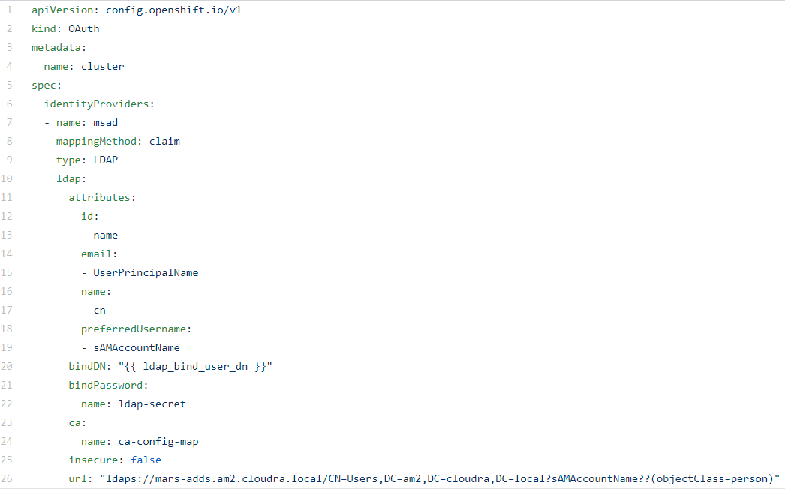

line 7: this is the name you want to give to the identity provider. This name if prefixed to the returned user ID to form an identity name. This is shown in the screenshot below:

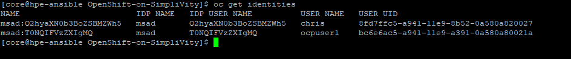

line 8: `mappingMethod`: claim. Provisions a user with the identity’s preferred user name. Fails if a user with that user name is already mapped to another identity. Refer to the OpenShift documentation to see which other options are available.

line 13: The `name` attribute in the Directory is used as the identity (base64 encoded). You can see this in the screenshot above.

line 15: The `UserPrincipalName` attribute in the directory service is used to populate the email address of the user.

line 17: The `cn` attribute in the Directory is used as the display name

line 19: We use the `sAMAccountName` attribute of the Directory to configure the preferred user name

line 20: LDAP user used to bind with the Directory. The actual user is specified in `group_vars/all/vars/yml`

line 22: Password for the `bindDN` user. Actually this is the name of a secret that the playbooks creates in the `openshift-config` namespace.

line 24: CA certificate which signed the LDAP server certificate. This is required in order to use the secure LDAP protocol (ldap over TLS, aka `ldaps`)

line 25: Use `ldaps`!

line 26: This is the RFC 2255 URL.

Here is the URL:

ldaps://mars-adds.am2.cloudra.local/CN=Users,DC=am2,DC=cloudra,DC=local?sAMAccountName??(objectClass=person)

The syntax of the URL is:

```bash
ldap://host:port/basedn?attribute?scope?filter
```

| URL Component | Value                               | Explanation                                                  |
| ------------- | ----------------------------------- | ------------------------------------------------------------ |
| protocol      | ldaps                               | Use ldaps to communicate with the server                     |
| host:port     | mars-adds.am2.cloudra.local         | This is the FQDN of the LDAP server in this example. The default port is used for ldaps. |
| basedn        | CN=Users,DC=am2,DC=cloudra,DC=local | The DN of the branch of the directory where all searches should start from. |
| attribute     | sAMAccountName                      | The attribute to search for. When someone tries to login with the name "john" the Identity provider will try to find an entry in the directory service with this attribute set to "john". |
| scope         | ( no value)                         | We use the default scope which is **sub**. (search the LDAP tree starting at the basedn including branches) |
| filter        | (objectClass=person)                | We will only look for objects corresponding to users in the Directory. |

Below is the corresponding LDAP tree.

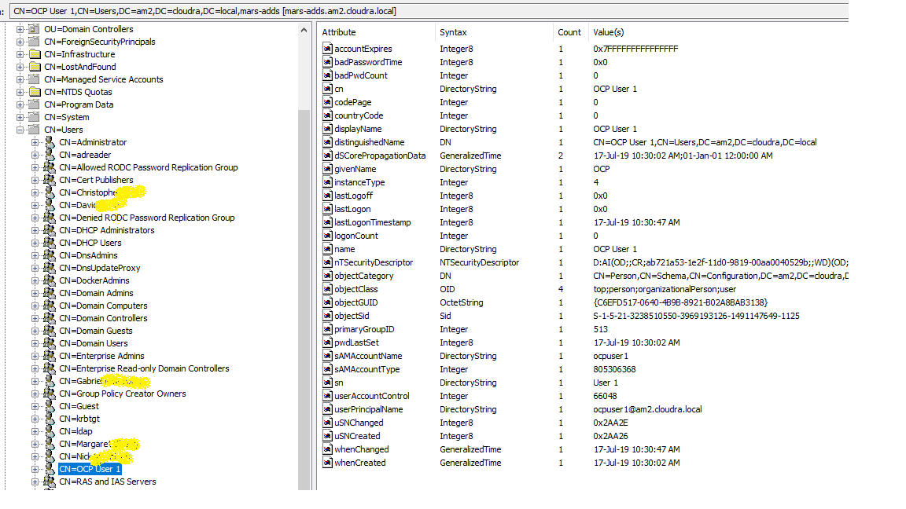

